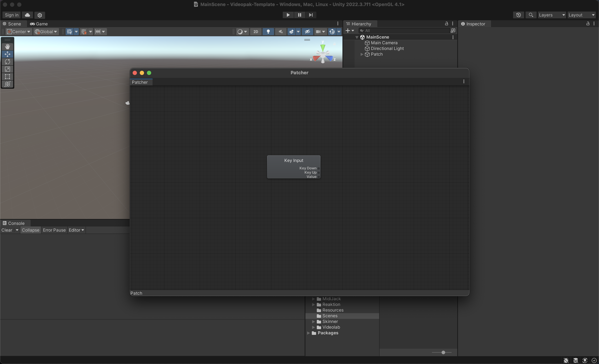

# Videolab-Template
Looking to get started with making a Videopak for the Teenage Engineering OP-Z but not sure how? Look no further!\
\
This project contains a Unity project with assets and settings pre-configured for Videopak-making. Just download from the Releases tab and import the project into Unity Hub!

Learn more about Videolab here: [Official Videolab Wiki](https://github.com/teenageengineering/videolab/wiki/Getting-started)
